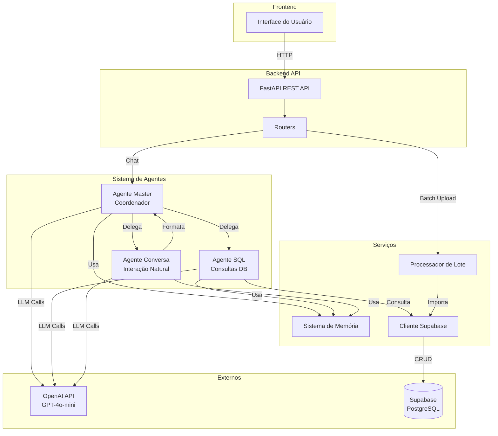
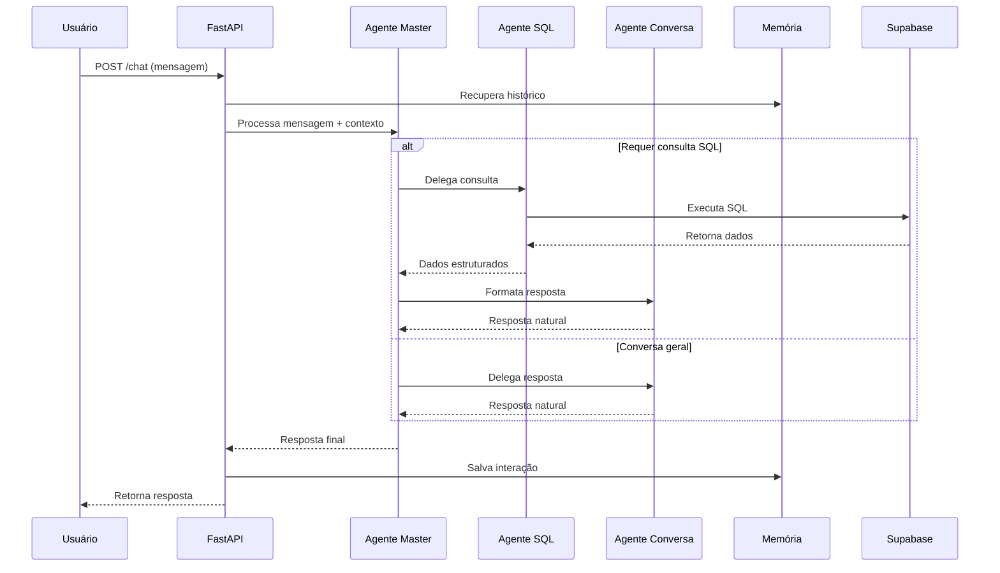

# Design Document

## Overview

O sistema multi-agente de IA para processamento de NF-e é uma aplicação backend construída em Python que utiliza três agentes especializados baseados em GPT-4o-mini para processar notas fiscais eletrônicas e responder perguntas dos usuários. O sistema segue uma arquitetura modular com separação clara de responsabilidades, permitindo processamento em lote de XMLs e interação conversacional através de uma API REST.

### Principais Componentes

1. **API REST (FastAPI)**: Interface HTTP para comunicação com frontend
2. **Sistema de Agentes**: Três agentes especializados que colaboram entre si
3. **Processador de Lote**: Componente para importação massiva de XMLs
4. **Sistema de Memória**: Gerenciamento de contexto conversacional
5. **Camada de Dados**: Integração com Supabase PostgreSQL

## Architecture

### Diagrama de Arquitetura



### Fluxo de Processamento de Chat



## Components and Interfaces

### 1. API Layer (FastAPI)

**Responsabilidade**: Expor endpoints HTTP para comunicação com frontend

**Estrutura de Arquivos**:
```
backend/
├── main.py                 # Aplicação FastAPI principal
├── api/
│   ├── __init__.py
│   ├── routes/
│   │   ├── __init__.py
│   │   ├── chat.py        # Endpoints de chat
│   │   └── batch.py       # Endpoints de processamento em lote
│   └── models/
│       ├── __init__.py
│       ├── requests.py    # Modelos Pydantic de request
│       └── responses.py   # Modelos Pydantic de response
```

**Endpoints**:

```python
# POST /api/chat
class ChatRequest(BaseModel):
    session_id: str
    message: str
    
class ChatResponse(BaseModel):
    session_id: str
    message: str
    agent_used: str
    timestamp: datetime

# POST /api/batch/upload
class BatchUploadRequest(BaseModel):
    xml_folder: str = "xml_nf"
    
class BatchUploadResponse(BaseModel):
    total_files: int
    successful: int
    failed: int
    errors: List[Dict[str, str]]
    
# GET /api/batch/status/{job_id}
class BatchStatusResponse(BaseModel):
    job_id: str
    status: str
    progress: int
    total: int
```

### 2. Sistema de Agentes

**Responsabilidade**: Implementar lógica de IA para processamento de requisições

**Estrutura de Arquivos**:
```
backend/
├── agents/
│   ├── __init__.py
│   ├── base.py            # Classe base abstrata
│   ├── master.py          # Agente Master
│   ├── sql_agent.py       # Agente SQL
│   ├── conversation.py    # Agente Conversa
│   └── prompts/
│       ├── __init__.py
│       ├── master.py      # System prompts do Master
│       ├── sql.py         # System prompts do SQL
│       └── conversation.py # System prompts do Conversa
```

**Interface Base**:

```python
from abc import ABC, abstractmethod
from typing import Dict, Any, List

class BaseAgent(ABC):
    """Classe base para todos os agentes"""
    
    def __init__(self, openai_client, model: str = "gpt-4o-mini"):
        self.client = openai_client
        self.model = model
        self.system_prompt = self._get_system_prompt()
    
    @abstractmethod
    def _get_system_prompt(self) -> str:
        """Retorna o system prompt específico do agente"""
        pass
    
    @abstractmethod
    async def process(self, message: str, context: Dict[str, Any]) -> Dict[str, Any]:
        """Processa uma mensagem com contexto"""
        pass
    
    async def _call_llm(self, messages: List[Dict[str, str]]) -> str:
        """Chama a API da OpenAI"""
        response = await self.client.chat.completions.create(
            model=self.model,
            messages=messages,
            temperature=0.7
        )
        return response.choices[0].message.content
```

**Agente Master**:

```python
class MasterAgent(BaseAgent):
    """Agente coordenador que gerencia outros agentes"""
    
    def __init__(self, openai_client, sql_agent, conversation_agent):
        super().__init__(openai_client)
        self.sql_agent = sql_agent
        self.conversation_agent = conversation_agent
    
    def _get_system_prompt(self) -> str:
        return """Você é o Agente Master, responsável por coordenar outros agentes especializados.
        
        Suas responsabilidades:
        1. Analisar a intenção da mensagem do usuário
        2. Decidir qual agente deve processar a requisição
        3. Delegar tarefas aos agentes especializados
        4. Consolidar respostas e retornar ao usuário
        
        Agentes disponíveis:
        - SQL Agent: Para consultas ao banco de dados de notas fiscais
        - Conversation Agent: Para respostas conversacionais e formatação
        
        Sempre mantenha o contexto da conversa e seja eficiente nas delegações."""
    
    async def process(self, message: str, context: Dict[str, Any]) -> Dict[str, Any]:
        # Analisa intenção
        intent = await self._analyze_intent(message, context)
        
        # Delega para agente apropriado
        if intent["requires_database"]:
            sql_result = await self.sql_agent.process(message, context)
            response = await self.conversation_agent.format_response(sql_result, context)
            agent_used = "sql"
        else:
            response = await self.conversation_agent.process(message, context)
            agent_used = "conversation"
        
        return {
            "response": response,
            "agent_used": agent_used,
            "intent": intent
        }
```

**Agente SQL**:

```python
class SQLAgent(BaseAgent):
    """Agente especializado em consultas SQL"""
    
    def __init__(self, openai_client, db_client, schema_info: str):
        super().__init__(openai_client)
        self.db = db_client
        self.schema = schema_info
    
    def _get_system_prompt(self) -> str:
        return f"""Você é um especialista em SQL para banco de dados PostgreSQL de notas fiscais eletrônicas.
        
        Schema do banco de dados:
        {self.schema}
        
        Suas responsabilidades:
        1. Gerar consultas SQL válidas e seguras baseadas em requisições em linguagem natural
        2. Executar as consultas no banco de dados
        3. Retornar resultados estruturados
        
        Regras importantes:
        - Use APENAS SELECT queries (nunca INSERT, UPDATE, DELETE)
        - Sempre use JOINs apropriados para relacionamentos
        - Limite resultados a 100 registros por padrão
        - Use agregações quando apropriado
        - Formate valores monetários corretamente"""
    
    async def process(self, message: str, context: Dict[str, Any]) -> Dict[str, Any]:
        # Gera SQL
        sql_query = await self._generate_sql(message, context)
        
        # Executa query
        try:
            results = await self.db.execute_query(sql_query)
            return {
                "success": True,
                "query": sql_query,
                "results": results,
                "count": len(results)
            }
        except Exception as e:
            return {
                "success": False,
                "error": str(e),
                "query": sql_query
            }
```

**Agente Conversa**:

```python
class ConversationAgent(BaseAgent):
    """Agente especializado em interação natural"""
    
    def _get_system_prompt(self) -> str:
        return """Você é um assistente amigável especializado em notas fiscais eletrônicas.
        
        Suas responsabilidades:
        1. Responder perguntas gerais sobre o sistema
        2. Formatar dados de consultas SQL em linguagem natural
        3. Manter conversas contextualizadas e amigáveis
        4. Explicar conceitos fiscais quando necessário
        
        Estilo de comunicação:
        - Profissional mas acessível
        - Claro e objetivo
        - Use exemplos quando apropriado
        - Formate valores monetários em R$ com separadores"""
    
    async def process(self, message: str, context: Dict[str, Any]) -> str:
        messages = self._build_messages(message, context)
        return await self._call_llm(messages)
    
    async def format_response(self, data: Dict[str, Any], context: Dict[str, Any]) -> str:
        """Formata dados estruturados em resposta natural"""
        prompt = f"""Formate os seguintes dados em uma resposta natural e amigável:
        
        Dados: {json.dumps(data, ensure_ascii=False, indent=2)}
        
        Contexto da conversa: {context.get('history', [])}"""
        
        messages = [
            {"role": "system", "content": self.system_prompt},
            {"role": "user", "content": prompt}
        ]
        return await self._call_llm(messages)
```

### 3. Sistema de Memória

**Responsabilidade**: Gerenciar contexto conversacional

**Estrutura**:
```
backend/
├── memory/
│   ├── __init__.py
│   ├── chat_memory.py     # Implementação de memória
│   └── storage.py         # Backend de armazenamento
```

**Interface**:

```python
from typing import List, Dict, Optional
from datetime import datetime

class ChatMessage(BaseModel):
    role: str  # "user" ou "assistant"
    content: str
    timestamp: datetime
    metadata: Optional[Dict[str, Any]] = None

class ChatMemory:
    """Gerencia histórico de conversação"""
    
    def __init__(self, max_messages: int = 4):  # 2 interações = 4 mensagens
        self.max_messages = max_messages
        self.sessions: Dict[str, List[ChatMessage]] = {}
    
    def add_message(self, session_id: str, role: str, content: str, metadata: Dict = None):
        """Adiciona mensagem ao histórico"""
        if session_id not in self.sessions:
            self.sessions[session_id] = []
        
        message = ChatMessage(
            role=role,
            content=content,
            timestamp=datetime.now(),
            metadata=metadata or {}
        )
        
        self.sessions[session_id].append(message)
        
        # Mantém apenas últimas N mensagens
        if len(self.sessions[session_id]) > self.max_messages:
            self.sessions[session_id] = self.sessions[session_id][-self.max_messages:]
    
    def get_history(self, session_id: str) -> List[Dict[str, str]]:
        """Retorna histórico formatado para OpenAI"""
        if session_id not in self.sessions:
            return []
        
        return [
            {"role": msg.role, "content": msg.content}
            for msg in self.sessions[session_id]
        ]
    
    def get_context_summary(self, session_id: str) -> str:
        """Retorna resumo do contexto"""
        history = self.get_history(session_id)
        if not history:
            return "Nenhum histórico disponível"
        
        return "\n".join([
            f"{msg['role']}: {msg['content'][:100]}..."
            for msg in history
        ])
    
    def clear_session(self, session_id: str):
        """Limpa histórico de uma sessão"""
        if session_id in self.sessions:
            del self.sessions[session_id]
```

### 4. Processador de Lote

**Responsabilidade**: Processar múltiplos XMLs em lote

**Estrutura**:
```
backend/
├── batch/
│   ├── __init__.py
│   ├── processor.py       # Lógica de processamento
│   └── job_manager.py     # Gerenciamento de jobs
```

**Interface**:

```python
from typing import List, Dict
import asyncio
from pathlib import Path

class BatchProcessor:
    """Processa múltiplos XMLs em lote"""
    
    def __init__(self, importer):
        self.importer = importer  # SupabaseNFeImporter do db.py
        self.jobs: Dict[str, Dict] = {}
    
    async def process_folder(self, folder_path: str, job_id: str) -> Dict[str, Any]:
        """Processa todos os XMLs de uma pasta"""
        xml_files = list(Path(folder_path).glob("*.xml"))
        
        self.jobs[job_id] = {
            "status": "running",
            "total": len(xml_files),
            "processed": 0,
            "successful": 0,
            "failed": 0,
            "errors": []
        }
        
        for xml_file in xml_files:
            try:
                await asyncio.to_thread(
                    self.importer.import_nfe,
                    str(xml_file)
                )
                self.jobs[job_id]["successful"] += 1
            except Exception as e:
                self.jobs[job_id]["failed"] += 1
                self.jobs[job_id]["errors"].append({
                    "file": xml_file.name,
                    "error": str(e)
                })
            finally:
                self.jobs[job_id]["processed"] += 1
        
        self.jobs[job_id]["status"] = "completed"
        return self.jobs[job_id]
    
    def get_job_status(self, job_id: str) -> Optional[Dict]:
        """Retorna status de um job"""
        return self.jobs.get(job_id)
```

### 5. Cliente Supabase

**Responsabilidade**: Abstração para operações no banco de dados

**Estrutura**:
```
backend/
├── database/
│   ├── __init__.py
│   ├── client.py          # Cliente Supabase
│   └── schema.py          # Informações do schema
```

**Interface**:

```python
import requests
from typing import List, Dict, Any

class SupabaseClient:
    """Cliente para operações no Supabase"""
    
    def __init__(self, url: str, service_key: str):
        self.base_url = f"{url}/rest/v1"
        self.headers = {
            "apikey": service_key,
            "Authorization": f"Bearer {service_key}",
            "Content-Type": "application/json"
        }
    
    async def execute_query(self, sql: str) -> List[Dict[str, Any]]:
        """Executa query SQL via RPC"""
        # Nota: Supabase não expõe SQL direto via REST
        # Precisamos usar stored procedures ou construir queries via REST API
        # Esta é uma simplificação - implementação real usaria psycopg2
        pass
    
    async def query_table(self, table: str, filters: Dict = None, 
                         select: str = "*", limit: int = 100) -> List[Dict]:
        """Query usando REST API do Supabase"""
        url = f"{self.base_url}/{table}"
        params = {"select": select, "limit": limit}
        
        if filters:
            for key, value in filters.items():
                params[key] = f"eq.{value}"
        
        response = requests.get(url, headers=self.headers, params=params)
        response.raise_for_status()
        return response.json()
```

## Data Models

### Modelos Pydantic para API

```python
from pydantic import BaseModel, Field
from typing import Optional, List, Dict, Any
from datetime import datetime

class ChatRequest(BaseModel):
    session_id: str = Field(..., description="ID único da sessão do usuário")
    message: str = Field(..., min_length=1, description="Mensagem do usuário")

class ChatResponse(BaseModel):
    session_id: str
    message: str
    agent_used: str
    timestamp: datetime
    metadata: Optional[Dict[str, Any]] = None

class BatchUploadRequest(BaseModel):
    xml_folder: str = Field(default="xml_nf", description="Pasta contendo XMLs")

class BatchUploadResponse(BaseModel):
    job_id: str
    total_files: int
    successful: int
    failed: int
    errors: List[Dict[str, str]]
    duration_seconds: float

class AgentContext(BaseModel):
    """Contexto passado entre agentes"""
    session_id: str
    history: List[Dict[str, str]]
    metadata: Dict[str, Any] = {}
```

### Schema do Banco de Dados

O schema já está definido em `database/schema_nfe_completo.sql`. As principais tabelas são:

- **empresas**: Emitentes e destinatários
- **notas_fiscais**: Dados principais das NF-e
- **nf_itens**: Produtos/serviços das notas
- **nf_itens_icms/ipi/pis/cofins**: Impostos dos itens
- **nf_pagamentos**: Formas de pagamento
- **nf_transporte**: Informações de transporte

## Error Handling

### Estratégia de Tratamento de Erros

```python
from enum import Enum
from typing import Optional

class ErrorCode(Enum):
    OPENAI_API_ERROR = "openai_api_error"
    DATABASE_ERROR = "database_error"
    INVALID_SQL = "invalid_sql"
    XML_PARSE_ERROR = "xml_parse_error"
    AGENT_ERROR = "agent_error"
    VALIDATION_ERROR = "validation_error"

class AppException(Exception):
    """Exceção base da aplicação"""
    
    def __init__(self, code: ErrorCode, message: str, details: Optional[Dict] = None):
        self.code = code
        self.message = message
        self.details = details or {}
        super().__init__(self.message)

# Exception handlers no FastAPI
@app.exception_handler(AppException)
async def app_exception_handler(request: Request, exc: AppException):
    return JSONResponse(
        status_code=400,
        content={
            "error": {
                "code": exc.code.value,
                "message": exc.message,
                "details": exc.details
            }
        }
    )

# Logging estruturado
import logging
import json

class StructuredLogger:
    def __init__(self, name: str):
        self.logger = logging.getLogger(name)
    
    def log_event(self, level: str, event: str, **kwargs):
        log_data = {
            "event": event,
            "timestamp": datetime.now().isoformat(),
            **kwargs
        }
        getattr(self.logger, level)(json.dumps(log_data))
```

### Tratamento por Componente

1. **API Layer**: Captura exceções e retorna respostas HTTP apropriadas
2. **Agentes**: Retornam erros estruturados que o Master pode processar
3. **Batch Processor**: Registra erros mas continua processamento
4. **Database**: Retry logic para falhas temporárias

## Testing Strategy

### Estrutura de Testes

```
backend/
├── tests/
│   ├── __init__.py
│   ├── conftest.py        # Fixtures pytest
│   ├── unit/
│   │   ├── test_agents.py
│   │   ├── test_memory.py
│   │   └── test_batch.py
│   ├── integration/
│   │   ├── test_api.py
│   │   └── test_database.py
│   └── fixtures/
│       ├── sample.xml
│       └── mock_responses.json
```

### Estratégia de Testes

**Testes Unitários**:
- Testar cada agente isoladamente com mocks da OpenAI
- Testar sistema de memória
- Testar parsing de XML
- Testar geração de SQL

**Testes de Integração**:
- Testar fluxo completo de chat
- Testar processamento de lote
- Testar integração com Supabase (usando banco de teste)

**Mocks e Fixtures**:
```python
# conftest.py
import pytest
from unittest.mock import AsyncMock, Mock

@pytest.fixture
def mock_openai_client():
    client = AsyncMock()
    client.chat.completions.create = AsyncMock(
        return_value=Mock(
            choices=[Mock(message=Mock(content="Resposta mockada"))]
        )
    )
    return client

@pytest.fixture
def mock_supabase_client():
    client = Mock()
    client.execute_query = AsyncMock(return_value=[{"id": 1, "valor": 100.00}])
    return client

@pytest.fixture
def sample_chat_context():
    return {
        "session_id": "test-session",
        "history": [
            {"role": "user", "content": "Olá"},
            {"role": "assistant", "content": "Olá! Como posso ajudar?"}
        ]
    }
```

## Configuration Management

### Variáveis de Ambiente

```bash
# .env.example
# OpenAI
OPENAI_API_KEY=sk-...

# Supabase
SUPABASE_URL=https://xxx.supabase.co
SUPABASE_SERVICE_KEY=eyJ...

# Aplicação
APP_ENV=development
LOG_LEVEL=INFO
MAX_CHAT_HISTORY=4

# Batch Processing
XML_FOLDER=xml_nf
MAX_CONCURRENT_UPLOADS=5
```

### Configuração da Aplicação

```python
from pydantic_settings import BaseSettings

class Settings(BaseSettings):
    # OpenAI
    openai_api_key: str
    openai_model: str = "gpt-4o-mini"
    
    # Supabase
    supabase_url: str
    supabase_service_key: str
    
    # App
    app_env: str = "development"
    log_level: str = "INFO"
    max_chat_history: int = 4
    
    # Batch
    xml_folder: str = "xml_nf"
    max_concurrent_uploads: int = 5
    
    class Config:
        env_file = ".env"

settings = Settings()
```

## Deployment Considerations

### Estrutura Final do Projeto

```
backend/
├── main.py                 # Entry point FastAPI
├── config.py               # Configurações
├── requirements.txt        # Dependências
├── .env.example           # Exemplo de variáveis
├── api/
│   ├── routes/
│   └── models/
├── agents/
│   ├── base.py
│   ├── master.py
│   ├── sql_agent.py
│   ├── conversation.py
│   └── prompts/
├── memory/
│   ├── chat_memory.py
│   └── storage.py
├── batch/
│   ├── processor.py
│   └── job_manager.py
├── database/
│   ├── client.py
│   ├── schema.py
│   └── db.py (existente)
├── utils/
│   ├── logger.py
│   └── exceptions.py
└── tests/
```

### Dependências Atualizadas

```txt
# requirements.txt
# OpenAI
openai>=1.0.0

# API Framework
fastapi>=0.104.0
uvicorn[standard]>=0.24.0
python-multipart
pydantic>=2.0.0
pydantic-settings

# Database
psycopg2-binary
requests

# Utilities
python-dateutil
python-dotenv
pyyaml

# Testing
pytest
pytest-asyncio
httpx  # Para testes de API
```

### Inicialização da Aplicação

```python
# main.py
from fastapi import FastAPI
from fastapi.middleware.cors import CORSMiddleware
import logging

from config import settings
from api.routes import chat, batch
from agents.master import MasterAgent
from agents.sql_agent import SQLAgent
from agents.conversation import ConversationAgent
from memory.chat_memory import ChatMemory
from database.client import SupabaseClient
from database.schema import get_schema_info
from openai import AsyncOpenAI

# Configurar logging
logging.basicConfig(level=settings.log_level)
logger = logging.getLogger(__name__)

# Inicializar aplicação
app = FastAPI(title="Multi-Agent NF-e System", version="1.0.0")

# CORS
app.add_middleware(
    CORSMiddleware,
    allow_origins=["*"],
    allow_credentials=True,
    allow_methods=["*"],
    allow_headers=["*"],
)

# Inicializar componentes
@app.on_event("startup")
async def startup_event():
    logger.info("Inicializando sistema...")
    
    # OpenAI client
    app.state.openai_client = AsyncOpenAI(api_key=settings.openai_api_key)
    
    # Database client
    app.state.db_client = SupabaseClient(
        settings.supabase_url,
        settings.supabase_service_key
    )
    
    # Schema info
    schema_info = get_schema_info()
    
    # Agentes
    app.state.sql_agent = SQLAgent(
        app.state.openai_client,
        app.state.db_client,
        schema_info
    )
    app.state.conversation_agent = ConversationAgent(app.state.openai_client)
    app.state.master_agent = MasterAgent(
        app.state.openai_client,
        app.state.sql_agent,
        app.state.conversation_agent
    )
    
    # Memória
    app.state.memory = ChatMemory(max_messages=settings.max_chat_history)
    
    logger.info("Sistema inicializado com sucesso!")

# Incluir routers
app.include_router(chat.router, prefix="/api", tags=["chat"])
app.include_router(batch.router, prefix="/api", tags=["batch"])

@app.get("/")
async def root():
    return {"message": "Multi-Agent NF-e System API", "version": "1.0.0"}

@app.get("/health")
async def health():
    return {"status": "healthy"}
```

## Performance Considerations

1. **Async/Await**: Todas as operações I/O são assíncronas
2. **Connection Pooling**: Reutilizar conexões com Supabase e OpenAI
3. **Caching**: Cache de schema do banco de dados
4. **Rate Limiting**: Limitar chamadas à OpenAI API
5. **Batch Processing**: Processar XMLs em paralelo com limite de concorrência

## Security Considerations

1. **Variáveis de Ambiente**: Nunca commitar credenciais
2. **SQL Injection**: Usar apenas queries parametrizadas
3. **API Keys**: Rotacionar periodicamente
4. **CORS**: Configurar origins permitidas em produção
5. **Input Validation**: Validar todas as entradas com Pydantic
