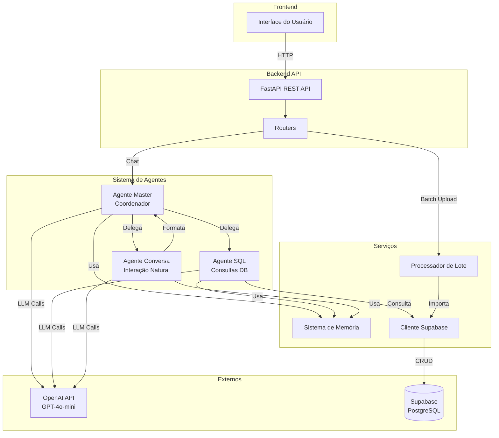
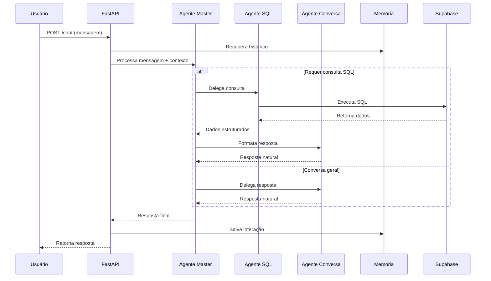

# Design Document

## Overview

O sistema multi-agente de IA para processamento de NF-e é uma aplicação backend construída em Python que utiliza **CrewAI** para orquestrar três agentes especializados baseados em GPT-4o-mini. Os agentes trabalham em equipe (Crew) para processar notas fiscais eletrônicas e responder perguntas dos usuários através de um chat interativo. O sistema segue uma arquitetura modular com separação clara de responsabilidades, permitindo processamento em lote de XMLs e interação conversacional através de uma API REST.

### Principais Componentes

1. **API REST (FastAPI)**: Interface HTTP para comunicação com frontend
2. **CrewAI System**: Framework de orquestração multi-agente com três agentes especializados
3. **Processador de Lote**: Componente para importação massiva de XMLs
4. **Sistema de Memória**: Gerenciamento de contexto conversacional integrado ao CrewAI
5. **Camada de Dados**: Integração com Supabase PostgreSQL

### Por que CrewAI?

- **Orquestração Nativa**: CrewAI gerencia automaticamente a comunicação e delegação entre agentes
- **Escalabilidade**: Fácil adicionar novos agentes especializados sem refatoração
- **Processos Flexíveis**: Suporta execução sequencial e hierárquica de tarefas
- **Memória Integrada**: Sistema de memória built-in para contexto conversacional
- **Production-Ready**: Framework robusto e testado em ambientes empresariais

## Architecture

### Diagrama de Arquitetura



### Fluxo de Processamento de Chat



## Components and Interfaces

### 1. API Layer (FastAPI)

**Responsabilidade**: Expor endpoints HTTP para comunicação com frontend

**Estrutura de Arquivos**:

```
backend/
├── main.py                 # Aplicação FastAPI principal
├── api/
│   ├── __init__.py
│   ├── routes/
│   │   ├── __init__.py
│   │   ├── chat.py        # Endpoints de chat
│   │   └── batch.py       # Endpoints de processamento em lote
│   └── models/
│       ├── __init__.py
│       ├── requests.py    # Modelos Pydantic de request
│       └── responses.py   # Modelos Pydantic de response
```

**Endpoints**:

```python
# POST /api/chat
class ChatRequest(BaseModel):
    session_id: str
    message: str

class ChatResponse(BaseModel):
    session_id: str
    message: str
    agent_used: str
    timestamp: datetime

# POST /api/batch/upload
class BatchUploadRequest(BaseModel):
    xml_folder: str = "xml_nf"

class BatchUploadResponse(BaseModel):
    total_files: int
    successful: int
    failed: int
    errors: List[Dict[str, str]]

# GET /api/batch/status/{job_id}
class BatchStatusResponse(BaseModel):
    job_id: str
    status: str
    progress: int
    total: int
```

### 2. Sistema de Agentes com CrewAI

**Responsabilidade**: Implementar lógica de IA para processamento de requisições usando CrewAI

**Estrutura de Arquivos**:

```
backend/
├── agents/
│   ├── __init__.py
│   ├── crew.py            # Definição da Crew e orquestração
│   ├── tools/
│   │   ├── __init__.py
│   │   ├── database_tool.py  # Tool para consultas SQL
│   │   └── schema_tool.py    # Tool para informações do schema
│   └── config/
│       ├── __init__.py
│       ├── agents.yaml    # Configuração dos agentes
│       └── tasks.yaml     # Configuração das tarefas
```

**Configuração dos Agentes (agents.yaml)**:

```yaml
# agents/config/agents.yaml

sql_specialist:
  role: >
    Especialista em Consultas SQL de Notas Fiscais
  goal: >
    Gerar e executar consultas SQL precisas e seguras no banco de dados PostgreSQL
    de notas fiscais eletrônicas, retornando dados estruturados
  backstory: >
    Você é um especialista em SQL com profundo conhecimento do schema de notas fiscais.
    Você sempre gera queries otimizadas, usa JOINs apropriados e limita resultados.
    Você NUNCA executa queries de modificação (INSERT, UPDATE, DELETE), apenas SELECT.
    Você formata valores monetários corretamente e usa agregações quando apropriado.

conversation_specialist:
  role: >
    Especialista em Comunicação e Formatação de Respostas
  goal: >
    Transformar dados estruturados em respostas naturais e amigáveis,
    mantendo conversas contextualizadas sobre notas fiscais eletrônicas
  backstory: >
    Você é um assistente amigável especializado em notas fiscais eletrônicas.
    Você transforma dados técnicos em explicações claras e acessíveis.
    Você mantém tom profissional mas acessível, usa exemplos quando apropriado,
    e formata valores monetários em R$ com separadores de milhares.

coordinator:
  role: >
    Coordenador de Agentes e Análise de Intenções
  goal: >
    Analisar mensagens dos usuários, determinar a melhor estratégia de resposta,
    e coordenar os agentes especializados para fornecer respostas precisas
  backstory: >
    Você é o coordenador principal que entende as necessidades dos usuários.
    Você decide quando consultar o banco de dados e quando fornecer respostas diretas.
    Você mantém o contexto da conversa e garante que as respostas sejam relevantes.
```

**Configuração das Tarefas (tasks.yaml)**:

```yaml
# agents/config/tasks.yaml

analyze_intent:
  description: >
    Analise a mensagem do usuário: "{message}"

    Contexto da conversa: {chat_history}

    Determine se a mensagem requer:
    1. Consulta ao banco de dados (perguntas sobre dados específicos de NF-e)
    2. Resposta conversacional (perguntas gerais, saudações, explicações)
  expected_output: >
    Uma decisão clara: "database_query" ou "conversation_only"
    com justificativa breve
  agent: coordinator

execute_sql_query:
  description: >
    Execute uma consulta SQL para responder: "{message}"

    Schema disponível: {database_schema}
    Contexto: {chat_history}

    Gere uma query SQL válida, execute-a e retorne os resultados estruturados.
  expected_output: >
    Resultados da query em formato estruturado com:
    - Query SQL executada
    - Dados retornados
    - Contagem de registros
  agent: sql_specialist

format_response:
  description: >
    Formate a seguinte informação em uma resposta natural e amigável:

    Dados: {query_results}
    Mensagem original: "{message}"
    Contexto: {chat_history}

    Crie uma resposta conversacional que explique os dados de forma clara.
  expected_output: >
    Uma resposta em linguagem natural, amigável e contextualizada,
    formatando valores monetários em R$ e explicando os dados claramente
  agent: conversation_specialist

direct_conversation:
  description: >
    Responda à mensagem do usuário: "{message}"

    Contexto: {chat_history}

    Forneça uma resposta útil e amigável sobre o sistema de notas fiscais.
  expected_output: >
    Uma resposta conversacional direta, profissional e amigável
  agent: conversation_specialist
```

**Implementação da Crew (crew.py)**:

```python
from crewai import Agent, Crew, Task, Process
from crewai.project import CrewBase, agent, crew, task
from typing import Dict, Any, List
import yaml
from pathlib import Path

from agents.tools.database_tool import DatabaseQueryTool
from agents.tools.schema_tool import SchemaInfoTool

@CrewBase
class NFeCrew:
    """Crew para processamento de consultas sobre NF-e"""

    def __init__(self):
        # Carregar configurações
        config_path = Path(__file__).parent / "config"

        with open(config_path / "agents.yaml") as f:
            self.agents_config = yaml.safe_load(f)

        with open(config_path / "tasks.yaml") as f:
            self.tasks_config = yaml.safe_load(f)

        # Inicializar tools
        self.db_tool = DatabaseQueryTool()
        self.schema_tool = SchemaInfoTool()

    @agent
    def sql_specialist(self) -> Agent:
        return Agent(
            role=self.agents_config['sql_specialist']['role'],
            goal=self.agents_config['sql_specialist']['goal'],
            backstory=self.agents_config['sql_specialist']['backstory'],
            tools=[self.db_tool, self.schema_tool],
            verbose=True,
            allow_delegation=False
        )

    @agent
    def conversation_specialist(self) -> Agent:
        return Agent(
            role=self.agents_config['conversation_specialist']['role'],
            goal=self.agents_config['conversation_specialist']['goal'],
            backstory=self.agents_config['conversation_specialist']['backstory'],
            verbose=True,
            allow_delegation=False
        )

    @agent
    def coordinator(self) -> Agent:
        return Agent(
            role=self.agents_config['coordinator']['role'],
            goal=self.agents_config['coordinator']['goal'],
            backstory=self.agents_config['coordinator']['backstory'],
            verbose=True,
            allow_delegation=True  # Pode delegar para outros agentes
        )

    @task
    def analyze_intent_task(self) -> Task:
        return Task(
            description=self.tasks_config['analyze_intent']['description'],
            expected_output=self.tasks_config['analyze_intent']['expected_output'],
            agent=self.coordinator()
        )

    @task
    def execute_sql_task(self) -> Task:
        return Task(
            description=self.tasks_config['execute_sql_query']['description'],
            expected_output=self.tasks_config['execute_sql_query']['expected_output'],
            agent=self.sql_specialist()
        )

    @task
    def format_response_task(self) -> Task:
        return Task(
            description=self.tasks_config['format_response']['description'],
            expected_output=self.tasks_config['format_response']['expected_output'],
            agent=self.conversation_specialist()
        )

    @task
    def direct_conversation_task(self) -> Task:
        return Task(
            description=self.tasks_config['direct_conversation']['description'],
            expected_output=self.tasks_config['direct_conversation']['expected_output'],
            agent=self.conversation_specialist()
        )

    @crew
    def crew(self) -> Crew:
        """Cria a crew com processo hierárquico"""
        return Crew(
            agents=[self.coordinator(), self.sql_specialist(), self.conversation_specialist()],
            tasks=[],  # Tasks são adicionadas dinamicamente
            process=Process.hierarchical,  # Coordinator gerencia automaticamente
            manager_agent=self.coordinator(),
            verbose=True,
            memory=True  # Habilita memória de contexto
        )

    def process_message(self, message: str, chat_history: List[Dict] = None) -> str:
        """Processa uma mensagem do usuário"""
        inputs = {
            "message": message,
            "chat_history": chat_history or [],
            "database_schema": self.schema_tool.get_schema()
        }

        # Kickoff da crew com inputs
        result = self.crew().kickoff(inputs=inputs)
        return result
```

**CrewAI Tools**:

```python
# agents/tools/database_tool.py
from crewai_tools import BaseTool
from typing import Type
from pydantic import BaseModel, Field
import psycopg2
from config import settings

class DatabaseQueryInput(BaseModel):
    """Input para DatabaseQueryTool"""
    sql_query: str = Field(..., description="Query SQL SELECT para executar")

class DatabaseQueryTool(BaseTool):
    name: str = "Database Query Tool"
    description: str = (
        "Executa queries SQL SELECT no banco de dados PostgreSQL de notas fiscais. "
        "Use esta tool para buscar dados de NF-e. "
        "IMPORTANTE: Apenas queries SELECT são permitidas."
    )
    args_schema: Type[BaseModel] = DatabaseQueryInput

    def _run(self, sql_query: str) -> dict:
        """Executa query SQL e retorna resultados"""
        # Validar que é apenas SELECT
        if not sql_query.strip().upper().startswith('SELECT'):
            return {
                "success": False,
                "error": "Apenas queries SELECT são permitidas"
            }

        try:
            conn = psycopg2.connect(
                host=settings.supabase_url.replace('https://', '').split('.')[0],
                database="postgres",
                user="postgres",
                password=settings.supabase_service_key
            )

            cursor = conn.cursor()
            cursor.execute(sql_query)

            # Buscar resultados
            columns = [desc[0] for desc in cursor.description]
            results = []
            for row in cursor.fetchall():
                results.append(dict(zip(columns, row)))

            cursor.close()
            conn.close()

            return {
                "success": True,
                "query": sql_query,
                "results": results,
                "count": len(results)
            }
        except Exception as e:
            return {
                "success": False,
                "error": str(e),
                "query": sql_query
            }

# agents/tools/schema_tool.py
class SchemaInfoInput(BaseModel):
    """Input para SchemaInfoTool"""
    table_name: str = Field(default="all", description="Nome da tabela ou 'all' para todas")

class SchemaInfoTool(BaseTool):
    name: str = "Schema Info Tool"
    description: str = (
        "Retorna informações sobre o schema do banco de dados de notas fiscais. "
        "Use para entender quais tabelas e colunas estão disponíveis."
    )
    args_schema: Type[BaseModel] = SchemaInfoInput

    def _run(self, table_name: str = "all") -> str:
        """Retorna informações do schema"""
        schema_info = """
        Schema do Banco de Dados de Notas Fiscais Eletrônicas:

        Tabelas principais:

        1. empresas
           - id, cnpj, razao_social, nome_fantasia, inscricao_estadual
           - logradouro, numero, complemento, bairro, municipio, uf, cep
           - telefone, email

        2. notas_fiscais
           - id, chave_acesso, numero, serie, data_emissao, data_saida
           - emitente_id (FK empresas), destinatario_id (FK empresas)
           - valor_total, valor_produtos, valor_frete, valor_seguro, valor_desconto
           - valor_icms, valor_ipi, valor_pis, valor_cofins
           - natureza_operacao, tipo_operacao, finalidade

        3. nf_itens
           - id, nota_fiscal_id (FK notas_fiscais)
           - numero_item, codigo_produto, descricao, ncm, cfop, unidade
           - quantidade, valor_unitario, valor_total, valor_desconto

        4. nf_itens_icms, nf_itens_ipi, nf_itens_pis, nf_itens_cofins
           - Impostos detalhados por item

        5. nf_pagamentos
           - id, nota_fiscal_id (FK notas_fiscais)
           - forma_pagamento, valor_pagamento

        6. nf_transporte
           - id, nota_fiscal_id (FK notas_fiscais)
           - modalidade_frete, transportadora_id (FK empresas)
           - placa_veiculo, uf_veiculo
        """

        return schema_info

    def get_schema(self) -> str:
        """Método auxiliar para obter schema completo"""
        return self._run("all")
```

**Vantagens da Abordagem CrewAI**:

1. **Delegação Automática**: O agente coordinator (manager) delega automaticamente tarefas
2. **Memória Integrada**: CrewAI gerencia contexto conversacional nativamente
3. **Tools Reutilizáveis**: DatabaseQueryTool e SchemaInfoTool podem ser usados por qualquer agente
4. **Processo Hierárquico**: Coordinator age como manager, decidindo qual agente usar
5. **Configuração Declarativa**: Agentes e tarefas definidos em YAML, fácil de manter
6. **Escalável**: Adicionar novos agentes é simples - apenas criar novo agent e tasks

### 3. Sistema de Memória

**Responsabilidade**: Gerenciar contexto conversacional

**Estrutura**:

```
backend/
├── memory/
│   ├── __init__.py
│   ├── chat_memory.py     # Implementação de memória
│   └── storage.py         # Backend de armazenamento
```

**Interface**:

```python
from typing import List, Dict, Optional
from datetime import datetime

class ChatMessage(BaseModel):
    role: str  # "user" ou "assistant"
    content: str
    timestamp: datetime
    metadata: Optional[Dict[str, Any]] = None

class ChatMemory:
    """Gerencia histórico de conversação"""

    def __init__(self, max_messages: int = 4):  # 2 interações = 4 mensagens
        self.max_messages = max_messages
        self.sessions: Dict[str, List[ChatMessage]] = {}

    def add_message(self, session_id: str, role: str, content: str, metadata: Dict = None):
        """Adiciona mensagem ao histórico"""
        if session_id not in self.sessions:
            self.sessions[session_id] = []

        message = ChatMessage(
            role=role,
            content=content,
            timestamp=datetime.now(),
            metadata=metadata or {}
        )

        self.sessions[session_id].append(message)

        # Mantém apenas últimas N mensagens
        if len(self.sessions[session_id]) > self.max_messages:
            self.sessions[session_id] = self.sessions[session_id][-self.max_messages:]

    def get_history(self, session_id: str) -> List[Dict[str, str]]:
        """Retorna histórico formatado para OpenAI"""
        if session_id not in self.sessions:
            return []

        return [
            {"role": msg.role, "content": msg.content}
            for msg in self.sessions[session_id]
        ]

    def get_context_summary(self, session_id: str) -> str:
        """Retorna resumo do contexto"""
        history = self.get_history(session_id)
        if not history:
            return "Nenhum histórico disponível"

        return "\n".join([
            f"{msg['role']}: {msg['content'][:100]}..."
            for msg in history
        ])

    def clear_session(self, session_id: str):
        """Limpa histórico de uma sessão"""
        if session_id in self.sessions:
            del self.sessions[session_id]
```

### 4. Processador de Lote

**Responsabilidade**: Processar múltiplos XMLs em lote

**Estrutura**:

```
backend/
├── batch/
│   ├── __init__.py
│   ├── processor.py       # Lógica de processamento
│   └── job_manager.py     # Gerenciamento de jobs
```

**Interface**:

```python
from typing import List, Dict
import asyncio
from pathlib import Path

class BatchProcessor:
    """Processa múltiplos XMLs em lote"""

    def __init__(self, importer):
        self.importer = importer  # SupabaseNFeImporter do db.py
        self.jobs: Dict[str, Dict] = {}

    async def process_folder(self, folder_path: str, job_id: str) -> Dict[str, Any]:
        """Processa todos os XMLs de uma pasta"""
        xml_files = list(Path(folder_path).glob("*.xml"))

        self.jobs[job_id] = {
            "status": "running",
            "total": len(xml_files),
            "processed": 0,
            "successful": 0,
            "failed": 0,
            "errors": []
        }

        for xml_file in xml_files:
            try:
                await asyncio.to_thread(
                    self.importer.import_nfe,
                    str(xml_file)
                )
                self.jobs[job_id]["successful"] += 1
            except Exception as e:
                self.jobs[job_id]["failed"] += 1
                self.jobs[job_id]["errors"].append({
                    "file": xml_file.name,
                    "error": str(e)
                })
            finally:
                self.jobs[job_id]["processed"] += 1

        self.jobs[job_id]["status"] = "completed"
        return self.jobs[job_id]

    def get_job_status(self, job_id: str) -> Optional[Dict]:
        """Retorna status de um job"""
        return self.jobs.get(job_id)
```

### 5. Cliente Supabase

**Responsabilidade**: Abstração para operações no banco de dados

**Estrutura**:

```
backend/
├── database/
│   ├── __init__.py
│   ├── client.py          # Cliente Supabase
│   └── schema.py          # Informações do schema
```

**Interface**:

```python
import requests
from typing import List, Dict, Any

class SupabaseClient:
    """Cliente para operações no Supabase"""

    def __init__(self, url: str, service_key: str):
        self.base_url = f"{url}/rest/v1"
        self.headers = {
            "apikey": service_key,
            "Authorization": f"Bearer {service_key}",
            "Content-Type": "application/json"
        }

    async def execute_query(self, sql: str) -> List[Dict[str, Any]]:
        """Executa query SQL via RPC"""
        # Nota: Supabase não expõe SQL direto via REST
        # Precisamos usar stored procedures ou construir queries via REST API
        # Esta é uma simplificação - implementação real usaria psycopg2
        pass

    async def query_table(self, table: str, filters: Dict = None,
                         select: str = "*", limit: int = 100) -> List[Dict]:
        """Query usando REST API do Supabase"""
        url = f"{self.base_url}/{table}"
        params = {"select": select, "limit": limit}

        if filters:
            for key, value in filters.items():
                params[key] = f"eq.{value}"

        response = requests.get(url, headers=self.headers, params=params)
        response.raise_for_status()
        return response.json()
```

## Data Models

### Modelos Pydantic para API

```python
from pydantic import BaseModel, Field
from typing import Optional, List, Dict, Any
from datetime import datetime

class ChatRequest(BaseModel):
    session_id: str = Field(..., description="ID único da sessão do usuário")
    message: str = Field(..., min_length=1, description="Mensagem do usuário")

class ChatResponse(BaseModel):
    session_id: str
    message: str
    agent_used: str
    timestamp: datetime
    metadata: Optional[Dict[str, Any]] = None

class BatchUploadRequest(BaseModel):
    xml_folder: str = Field(default="xml_nf", description="Pasta contendo XMLs")

class BatchUploadResponse(BaseModel):
    job_id: str
    total_files: int
    successful: int
    failed: int
    errors: List[Dict[str, str]]
    duration_seconds: float

class AgentContext(BaseModel):
    """Contexto passado entre agentes"""
    session_id: str
    history: List[Dict[str, str]]
    metadata: Dict[str, Any] = {}
```

### Schema do Banco de Dados

O schema já está definido em `database/schema_nfe_completo.sql`. As principais tabelas são:

- **empresas**: Emitentes e destinatários
- **notas_fiscais**: Dados principais das NF-e
- **nf_itens**: Produtos/serviços das notas
- **nf_itens_icms/ipi/pis/cofins**: Impostos dos itens
- **nf_pagamentos**: Formas de pagamento
- **nf_transporte**: Informações de transporte

## Error Handling

### Estratégia de Tratamento de Erros

```python
from enum import Enum
from typing import Optional

class ErrorCode(Enum):
    OPENAI_API_ERROR = "openai_api_error"
    DATABASE_ERROR = "database_error"
    INVALID_SQL = "invalid_sql"
    XML_PARSE_ERROR = "xml_parse_error"
    AGENT_ERROR = "agent_error"
    VALIDATION_ERROR = "validation_error"

class AppException(Exception):
    """Exceção base da aplicação"""

    def __init__(self, code: ErrorCode, message: str, details: Optional[Dict] = None):
        self.code = code
        self.message = message
        self.details = details or {}
        super().__init__(self.message)

# Exception handlers no FastAPI
@app.exception_handler(AppException)
async def app_exception_handler(request: Request, exc: AppException):
    return JSONResponse(
        status_code=400,
        content={
            "error": {
                "code": exc.code.value,
                "message": exc.message,
                "details": exc.details
            }
        }
    )

# Logging estruturado
import logging
import json

class StructuredLogger:
    def __init__(self, name: str):
        self.logger = logging.getLogger(name)

    def log_event(self, level: str, event: str, **kwargs):
        log_data = {
            "event": event,
            "timestamp": datetime.now().isoformat(),
            **kwargs
        }
        getattr(self.logger, level)(json.dumps(log_data))
```

### Tratamento por Componente

1. **API Layer**: Captura exceções e retorna respostas HTTP apropriadas
2. **Agentes**: Retornam erros estruturados que o Master pode processar
3. **Batch Processor**: Registra erros mas continua processamento
4. **Database**: Retry logic para falhas temporárias

## Testing Strategy

### Estrutura de Testes

```
backend/
├── tests/
│   ├── __init__.py
│   ├── conftest.py        # Fixtures pytest
│   ├── unit/
│   │   ├── test_agents.py
│   │   ├── test_memory.py
│   │   └── test_batch.py
│   ├── integration/
│   │   ├── test_api.py
│   │   └── test_database.py
│   └── fixtures/
│       ├── sample.xml
│       └── mock_responses.json
```

### Estratégia de Testes

**Testes Unitários**:

- Testar cada agente isoladamente com mocks da OpenAI
- Testar sistema de memória
- Testar parsing de XML
- Testar geração de SQL

**Testes de Integração**:

- Testar fluxo completo de chat
- Testar processamento de lote
- Testar integração com Supabase (usando banco de teste)

**Mocks e Fixtures**:

```python
# conftest.py
import pytest
from unittest.mock import AsyncMock, Mock

@pytest.fixture
def mock_openai_client():
    client = AsyncMock()
    client.chat.completions.create = AsyncMock(
        return_value=Mock(
            choices=[Mock(message=Mock(content="Resposta mockada"))]
        )
    )
    return client

@pytest.fixture
def mock_supabase_client():
    client = Mock()
    client.execute_query = AsyncMock(return_value=[{"id": 1, "valor": 100.00}])
    return client

@pytest.fixture
def sample_chat_context():
    return {
        "session_id": "test-session",
        "history": [
            {"role": "user", "content": "Olá"},
            {"role": "assistant", "content": "Olá! Como posso ajudar?"}
        ]
    }
```

## Configuration Management

### Variáveis de Ambiente

```bash
# .env.example
# OpenAI
OPENAI_API_KEY=sk-...

# Supabase
SUPABASE_URL=https://xxx.supabase.co
SUPABASE_SERVICE_KEY=eyJ...

# Aplicação
APP_ENV=development
LOG_LEVEL=INFO
MAX_CHAT_HISTORY=4

# Batch Processing
XML_FOLDER=xml_nf
MAX_CONCURRENT_UPLOADS=5
```

### Configuração da Aplicação

```python
from pydantic_settings import BaseSettings

class Settings(BaseSettings):
    # OpenAI
    openai_api_key: str
    openai_model: str = "gpt-4o-mini"

    # Supabase
    supabase_url: str
    supabase_service_key: str

    # App
    app_env: str = "development"
    log_level: str = "INFO"
    max_chat_history: int = 4

    # Batch
    xml_folder: str = "xml_nf"
    max_concurrent_uploads: int = 5

    class Config:
        env_file = ".env"

settings = Settings()
```

## Deployment Considerations

### Estrutura Final do Projeto

```
backend/
├── main.py                 # Entry point FastAPI
├── config.py               # Configurações
├── requirements.txt        # Dependências
├── .env.example           # Exemplo de variáveis
├── api/
│   ├── routes/
│   └── models/
├── agents/
│   ├── base.py
│   ├── master.py
│   ├── sql_agent.py
│   ├── conversation.py
│   └── prompts/
├── memory/
│   ├── chat_memory.py
│   └── storage.py
├── batch/
│   ├── processor.py
│   └── job_manager.py
├── database/
│   ├── client.py
│   ├── schema.py
│   └── db.py (existente)
├── utils/
│   ├── logger.py
│   └── exceptions.py
└── tests/
```

### Dependências Atualizadas com CrewAI

```txt
# requirements.txt
# Multi-Agent Framework
crewai>=0.80.0
crewai-tools>=0.12.0

# OpenAI (required by CrewAI)
openai>=1.0.0

# API Framework
fastapi>=0.104.0
uvicorn[standard]>=0.24.0
python-multipart
pydantic>=2.0.0
pydantic-settings

# Database
psycopg2-binary
requests

# Utilities
python-dateutil
python-dotenv
pyyaml

# Testing
pytest
pytest-asyncio
httpx  # Para testes de API
```

### Inicialização da Aplicação com CrewAI

```python
# main.py
from fastapi import FastAPI
from fastapi.middleware.cors import CORSMiddleware
import logging
import os

from config import settings
from api.routes import chat, batch
from agents.crew import NFeCrew
from memory.chat_memory import ChatMemory

# Configurar logging
logging.basicConfig(level=settings.log_level)
logger = logging.getLogger(__name__)

# Configurar variáveis de ambiente para CrewAI
os.environ["OPENAI_API_KEY"] = settings.openai_api_key
os.environ["OPENAI_MODEL_NAME"] = settings.openai_model

# Inicializar aplicação
app = FastAPI(title="Multi-Agent NF-e System", version="1.0.0")

# CORS
app.add_middleware(
    CORSMiddleware,
    allow_origins=settings.cors_origins,
    allow_credentials=True,
    allow_methods=["*"],
    allow_headers=["*"],
)

# Inicializar componentes
@app.on_event("startup")
async def startup_event():
    logger.info("Inicializando sistema com CrewAI...")

    # Inicializar NFe Crew
    app.state.nfe_crew = NFeCrew()

    # Memória de chat (para histórico entre sessões)
    app.state.memory = ChatMemory(max_messages=settings.max_chat_history)

    logger.info("Sistema inicializado com sucesso!")
    logger.info(f"Agentes disponíveis: Coordinator, SQL Specialist, Conversation Specialist")

# Incluir routers
app.include_router(chat.router, prefix="/api", tags=["chat"])
app.include_router(batch.router, prefix="/api", tags=["batch"])

@app.get("/")
async def root():
    return {
        "message": "Multi-Agent NF-e System API",
        "version": "1.0.0",
        "framework": "CrewAI",
        "agents": ["Coordinator", "SQL Specialist", "Conversation Specialist"]
    }

@app.get("/health")
async def health():
    return {"status": "healthy", "framework": "CrewAI"}
```

**Exemplo de uso da Crew no endpoint de chat**:

```python
# api/routes/chat.py
from fastapi import APIRouter, HTTPException, Request
from api.models.requests import ChatRequest
from api.models.responses import ChatResponse
from datetime import datetime

router = APIRouter()

@router.post("/chat", response_model=ChatResponse)
async def chat(request: ChatRequest, app_request: Request):
    """Processa mensagem do usuário através da CrewAI"""
    try:
        # Recuperar histórico da memória
        memory = app_request.app.state.memory
        chat_history = memory.get_history(request.session_id)

        # Processar mensagem através da Crew
        nfe_crew = app_request.app.state.nfe_crew
        response_text = nfe_crew.process_message(
            message=request.message,
            chat_history=chat_history
        )

        # Salvar interação na memória
        memory.add_message(request.session_id, "user", request.message)
        memory.add_message(request.session_id, "assistant", response_text)

        return ChatResponse(
            session_id=request.session_id,
            message=response_text,
            agent_used="crewai_hierarchical",
            timestamp=datetime.now()
        )

    except Exception as e:
        raise HTTPException(status_code=500, detail=str(e))
```

## Performance Considerations

1. **Async/Await**: Todas as operações I/O são assíncronas
2. **Connection Pooling**: Reutilizar conexões com Supabase e OpenAI
3. **Caching**: Cache de schema do banco de dados
4. **Rate Limiting**: Limitar chamadas à OpenAI API
5. **Batch Processing**: Processar XMLs em paralelo com limite de concorrência

## Security Considerations

1. **Variáveis de Ambiente**: Nunca commitar credenciais
2. **SQL Injection**: Usar apenas queries parametrizadas
3. **API Keys**: Rotacionar periodicamente
4. **CORS**: Configurar origins permitidas em produção
5. **Input Validation**: Validar todas as entradas com Pydantic
